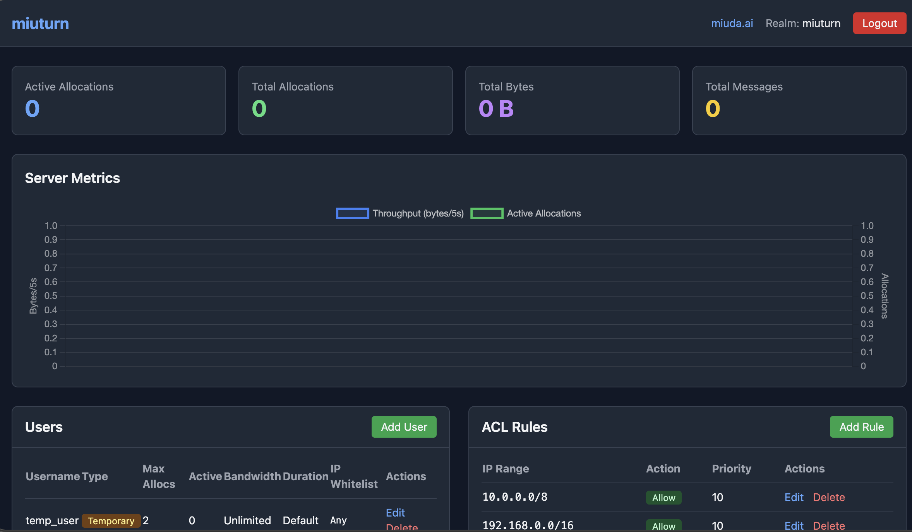

# miuturn

A high-performance TURN server written in Rust.



## Features

- **STUN/TURN Protocol Support**: RFC 5389/5766 compliant
- **Web Admin Console**: Built-in HTTP admin UI with real-time metrics dashboard
- **TURN REST API**: WebRTC credential generation with HMAC authentication
- **User Management**: Fixed, temporary, and API key users with per-user limits
- **ACL Rules**: IP-based access control with priority ordering
- **Real-time Metrics**: Live throughput and active allocations charts
- **Config Persistence**: UI changes auto-save to TOML
- **Prometheus Metrics**: Built-in metrics export
- **TCP & UDP**: Dual protocol support

## Quick Start

### Binary

```bash
cargo build --release
./target/release/miuturn
```

### Docker

#### Using Pre-built Image (Recommended)

```bash
docker run -p 3478:3478 -p 3478:3478/udp -p 8080:8080 docker.cnb.cool/miuda.ai/miuturn:latest
```

#### Build from Source

```bash
docker build -t miuturn .
docker run -p 3478:3478 -p 3478:3478/udp -p 8080:8080 miuturn
```

## Configuration

Create `miuturn.toml`:

```toml
[server]
realm = "miuturn"
external_ip = "YOUR PUBLIC IP HERE"
relay_bind_ip = "0.0.0.0"
start_port = 49152
end_port = 65535
max_concurrent_allocations = 1000
max_bandwidth_bytes_per_sec = 10485760
max_allocation_duration_secs = 3600

[[server.listening]]
protocol = "udp"
address = "0.0.0.0:3478"

[[server.listening]]
protocol = "tcp"
address = "0.0.0.0:3478"

[http]
address = "0.0.0.0:8080"
# Admin console credentials (separate from TURN users)
admin_username = "admin"
admin_password = "changeme"
turn_rest_enabled = true
turn_rest_secret = "your-secret-key"
turn_rest_default_lifetime = 3600

[[auth.users]]
username = "regular_user"
password = "userpass"
user_type = "fixed"
max_allocations = 5
bandwidth_limit = 1048576  # 1 MB/s limit
ip_whitelist = ["192.168.0.0/16"]

[[auth.users]]
username = "temp_user"
password = "temp123"
user_type = "temporary"
expires_at = 1735689600
max_allocations = 2

[auth.api_keys]
key1 = "admin"

[[auth.acl_rules]]
ip_range = "10.0.0.0/8"
action = "Allow"
priority = 10

[[auth.acl_rules]]
ip_range = "0.0.0.0/0"
action = "Deny"
priority = 1
```

`external_ip` is the relay address advertised back to clients.
`relay_bind_ip` is the local interface used to bind relay sockets. If omitted, it defaults to `0.0.0.0`. In NAT deployments, set `external_ip` to the public IP and keep `relay_bind_ip` as `0.0.0.0` (or a specific local interface IP if needed).

## Admin Console

Access the web UI at `http://localhost:8080/console`

The admin console provides:
- **Real-time Metrics Dashboard**: Live chart showing throughput and active allocations
- **Statistics Cards**: Active/total allocations, bytes relayed, messages
- **User Management**: Add/edit/delete TURN users with bandwidth and duration limits
- **ACL Rules**: Manage IP-based access control with priority ordering

Configure admin credentials in `[http]` section:
```toml
[http]
admin_username = "admin"
admin_password = "changeme"
```

**Note**: Admin console credentials are separate from TURN service users in `[[auth.users]]`.

## API Endpoints

| Endpoint                   | Method | Description               |
| -------------------------- | ------ | ------------------------- |
| `/health`                  | GET    | Server health and stats   |
| `/metrics`                 | GET    | Prometheus metrics        |
| `/api/v1/stats`            | GET    | Detailed stats + users    |
| `/api/v1/users`            | POST   | Add user                  |
| `/api/v1/users`            | PUT    | Update user               |
| `/api/v1/users`            | DELETE | Delete user               |
| `/api/v1/acl`              | POST   | Add ACL rule              |
| `/api/v1/acl`              | PUT    | Update ACL rule           |
| `/api/v1/acl`              | DELETE | Delete ACL rule           |
| `/api/v1/turn-credentials` | POST   | Generate TURN credentials |

## Environment Variables

- `CONFIG`: Path to config file (default: `miuturn.toml`)

## License

MIT License - Powered by [miuda.ai](https://miuda.ai)
